<div align="center">
  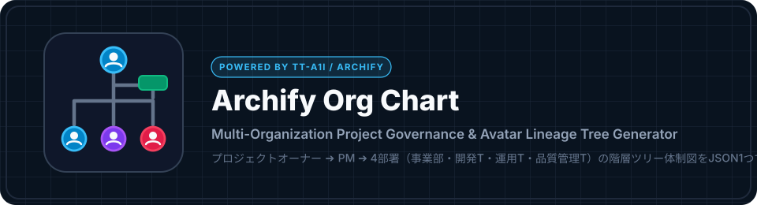

  <h1>Archify Org Chart</h1>

  <p>
    <strong><a href="https://github.com/tt-a1i/archify">tt-a1i/archify</a> を活用したマルチ組織・アバター付き「プロジェクト体制図」自動生成ツール＆テンプレート集</strong>
  </p>

  <p>
    <a href="https://github.com/Sunwood-ai-labs/archify-org-chart/actions/workflows/deploy-docs.yml"></a>
    <a href="https://github.com/tt-a1i/archify"></a>
    <a href="./LICENSE"></a>
    = 20" />
  </p>

  <p>
    <a href="./README.md"></a>
    <a href="./README.ja.md"></a>
    <a href="https://sunwood-ai-labs.github.io/archify-org-chart/ja/"></a>
  </p>
</div>

---

## ✨ 概要

**Archify Org Chart** は、[`tt-a1i/archify`](https://github.com/tt-a1i/archify) をベースに、日本のプロジェクト現場で定番の**「プロジェクト体制図（複数組織が絡む階層ツリー型）」**を JSON 設定ファイル1つから自動生成できるテンプレート＆CLIツールです。

1つの宣言的 JSON ファイル（`*.org.json`）を編集するだけで、以下の特徴を備えた単一 HTML（SVG内包）を出力します：

- **上位層から下位層へ分岐する定番ツリー構造**：頂点の `プロジェクトオーナー (事業部)` から垂直幹が伸び、途中から右へ `プロジェクトマネジメント` が分岐し、下部の4部署（`事業部` | `開発T` | `運用T` | `品質管理T`）へ4分岐する王道レイアウト。
- **「部署 / 担当者 / ロール」の3段マトリクス表示**：左端の行見出し（`部署`・`担当者`・`ロール`）に合わせて、各部署の主担当 `(主)` からメンバー `┗` への指揮系統ツリーと、各部署の担当ロール（`・役割1`、`・役割2`、`・役割3`...）を一覧表示。
- **全員の名前横に円形アバターアイコンを自動配置**：SVG内の全人物ノードおよびページ下部の体制図ボードの両方で、名前のすぐ横に円形ポートレートアバター（`.jpg` / `.png` / `.svg`、未指定時は自動イニシャルアイコン）を表示。
- **複数企業の混成チームでも誰が誰の系統か一目で判別**：たとえば `開発T` の中でプライム企業（アークシステムズ）の田中主担当から、社内アプリ担当（山本）と外部AIパートナー企業（イロドリAIラボ：渡辺 ➔ 小林）へ枝分かれする複数社横断の系統を、枠線の色・企業バッジ・ツリー矢印で明確に可視化します。

## 🖼️ プレビュー

### ダーク・ブループリント表示（`project-governance-with-avatars.html`）

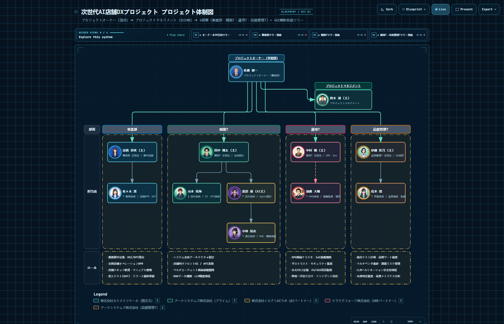

### ライト・印刷対応表示（`project-governance-with-avatars.html`）

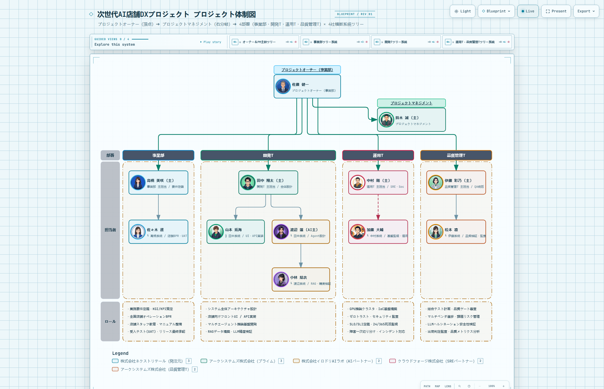

### マルチ組織横断・スイムレーン表示（`org-lineage-swimlane-with-avatars.html`）

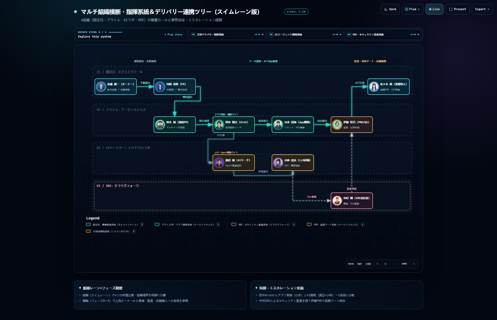

## 🎨 レイアウトバリエーション（8案）

同じ `*.org.json` から、見せ方の異なる8種類の体制図（単一HTML・アバター埋め込み済み）も生成できます。共通ルールは **「色＝所属会社だけ」**。同じ会社の組織は1社に統合し、兼務は「兼」で表示します。

```bash
npm run build:variants   # → variants/*.html（GitHub Pages 用に docs/public/variants にも出力）
```

👉 [ライブギャラリーを開く](https://sunwood-ai-labs.github.io/archify-org-chart/variants/)

**横断ビュー**

| 01 クリーンツリー | 02 会社×チーム マトリクス |
| :---: | :---: |
| 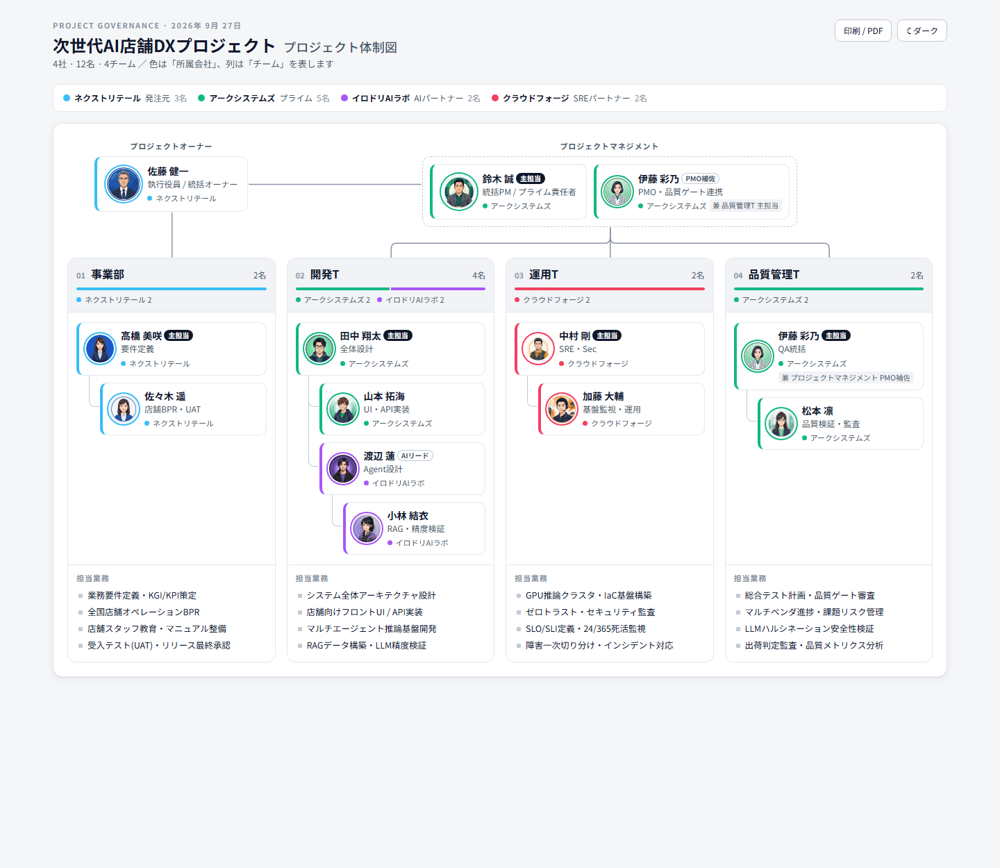 | 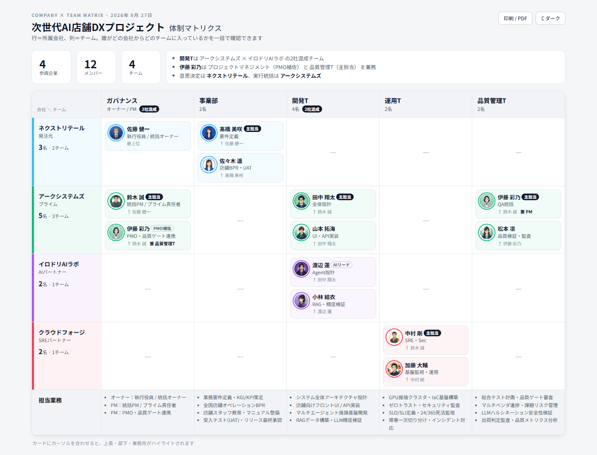 |
| **03 インタラクティブ・エクスプローラー** | **04 放射型マップ** |
| 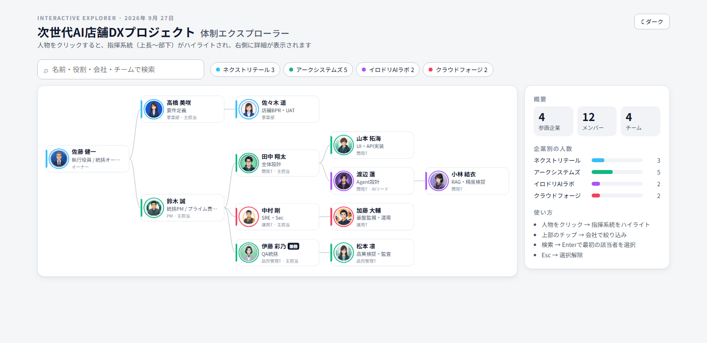 | 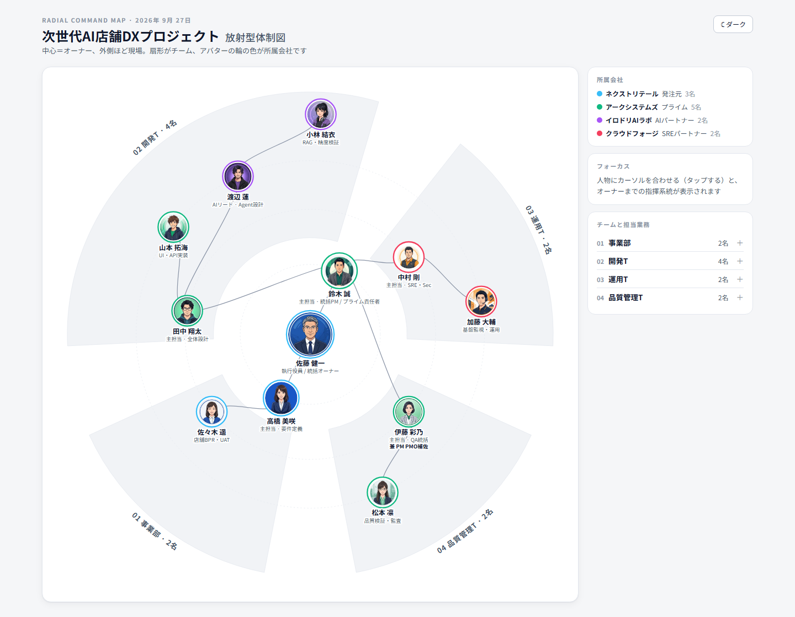 |

**上から下へ読む案**

| 05 トップダウン・ツリー | 06 階層そろえグリッド |
| :---: | :---: |
| 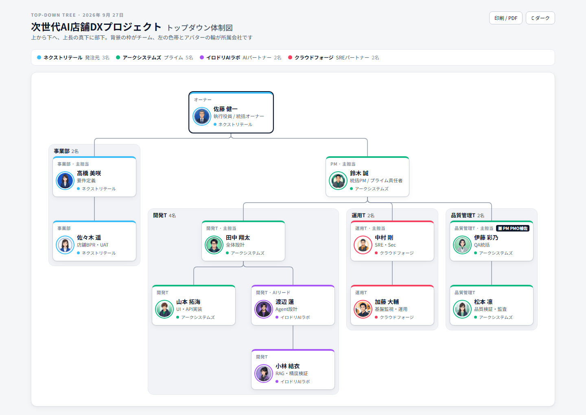 | 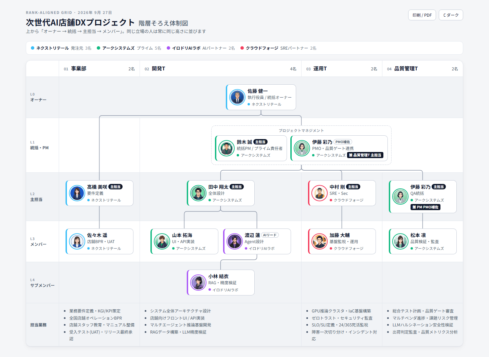 |
| **07 責任範囲マップ（アイシクル）** | **08 縦スクロール・アウトライン（スマホ向け）** |
| 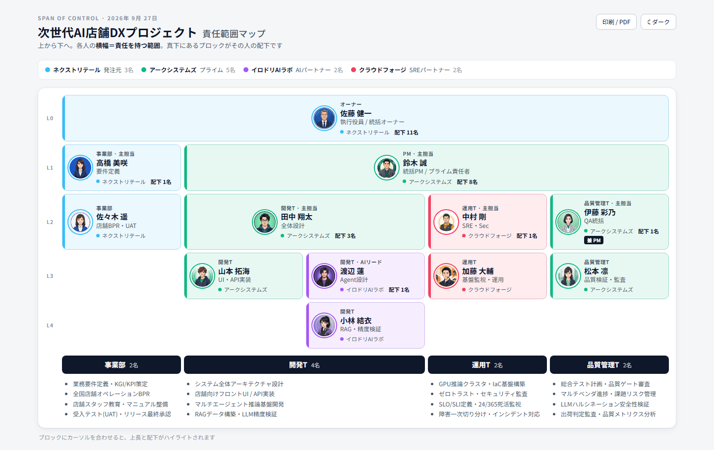 | 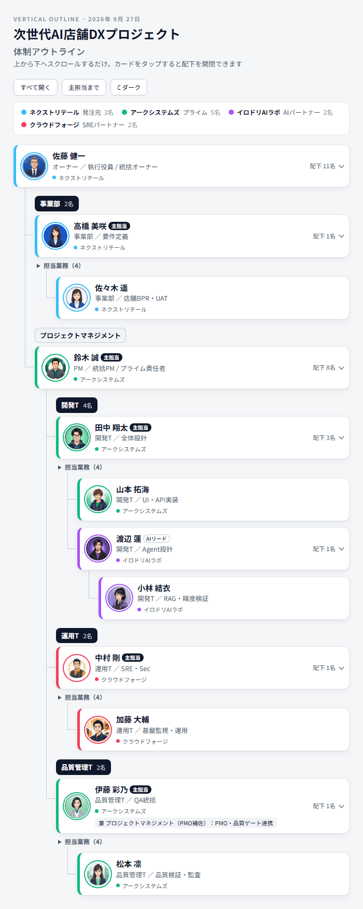 |

## 🖥️ 16:9 スライド版（会社資料向け4テイスト）

「階層そろえグリッド」（06）を 1920×1080 固定のスライドに仕上げたものです。3840×2160 の PNG を PowerPoint や Googleスライドにそのまま貼るか、HTML を印刷して 16:9 の PDF にできます。

```bash
npm run build:slides   # → slides/*.html + assets/slides/*.png（Chrome または Edge が必要。CHROME_PATH で指定可）
```

👉 [スライドギャラリーを開く](https://sunwood-ai-labs.github.io/archify-org-chart/slides/)

| A ネイビー・コーポレート | B ミニマル・モノトーン |
| :---: | :---: |
| 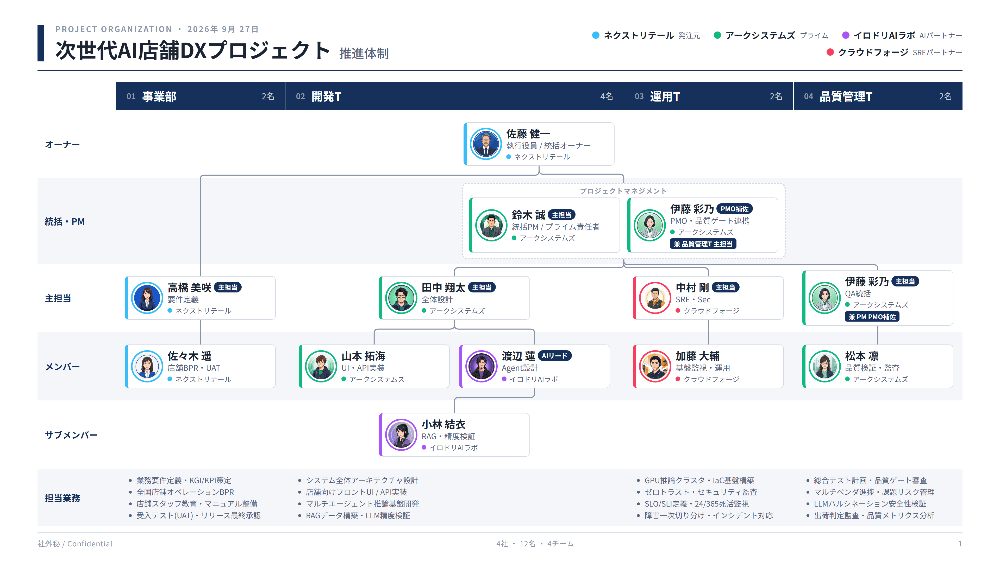 | 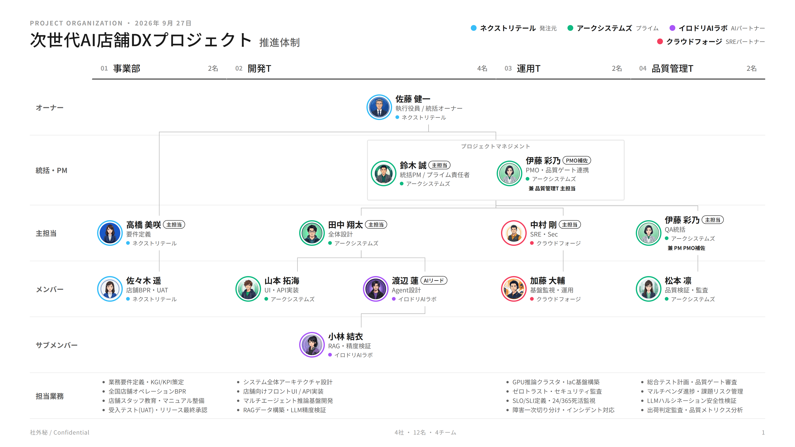 |
| **C クラシック罫線（写真なし）** | **D ダーク・キーノート** |
| 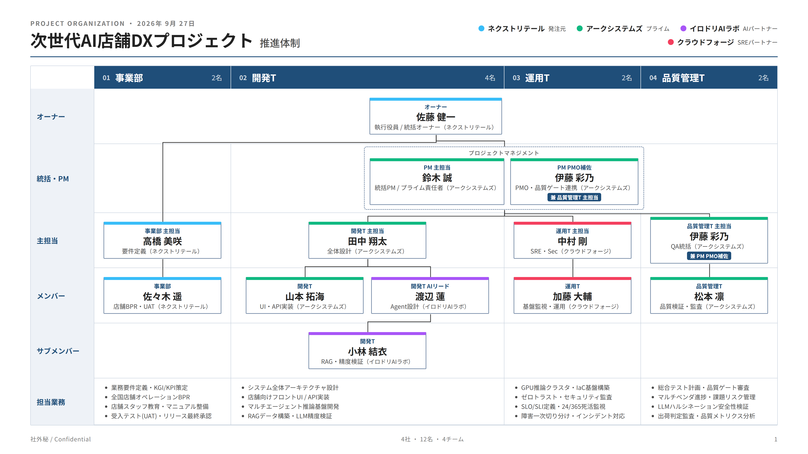 | 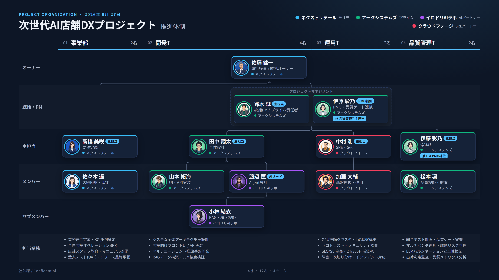 |

## 🚀 クイックスタート（誰でもすぐ作れる3ステップ）

### 1. リポジトリをクローン

```bash
git clone https://github.com/Sunwood-ai-labs/archify-org-chart.git
cd archify-org-chart

# Node.js 20以上とGitが必要です。固定版の描画エンジンを取得します。
npm run setup:archify
```

### 2. 体制図設定 JSON（`*.org.json`）を編集

穴埋め用のスターターテンプレート [`templates/starter.org.json`](./templates/starter.org.json) をコピーし、プロジェクト名・参加企業・担当者名・アバター画像パス・各部署の役割を書き換えます：

```bash
cp templates/starter.org.json my-project.org.json
```

### 3. 体制図 HTML をビルド

```bash
# サンプル（4社横断・全12名のアバター付きAI店舗DXプロジェクト体制図）をビルド
npm run build

# 自分のプロジェクト設定JSONから体制図HTMLを生成
node bin/archify-org-chart.mjs build my-project.org.json my-project.html
```

生成された `project-governance-with-avatars.html`（または `my-project.html`）をブラウザで開くだけで、アバター付きのインタラクティブ体制図が動作します（単一HTMLファイルのため、そのままSlackやTeams、Wiki等で共有可能です）。

## 🧩 設定ファイル（`*.org.json`）の構成

`*.org.json` は以下の5つのセクションで構成されます：

| フィールド | 説明 |
| :--- | :--- |
| `projectTitle` | 体制図上部のメインタイトル（例：`□□□□ プロジェクト プロジェクト体制図`） |
| `organizations` | 参画企業・組織の定義（`name`, `short`, `type`, `color`） |
| `owner` | 頂点のプロジェクトオーナー定義（`id`, `name`, `title`, `department`, `role`, `org`, `avatar`） |
| `pm` | 右分岐のプロジェクトマネジメント定義（`title`, 主担当 `lead`, 補佐 `members`） |
| `departments` | 4部署（`事業部`, `開発T`, `運用T`, `品質管理T`）の配列。各部署の `members`（`(主)` と `┗` 系統の親子関係 `parent`・顔アイコン `avatar`）と `roles`（`・役割1...`）を記述 |

`avatar` に画像ファイル（`avatars/thumb/xxx.jpg` 等）を指定すると円形トリミングされて名前の横に表示され、未指定の場合は所属企業カラーのSVG人物バッジが自動生成されます。

## 📂 ディレクトリ構成

```text
archify-org-chart/
├── assets/
│   ├── header-banner.svg                     # ヘッダーバナーSVG
│   ├── logo.svg                              # プロジェクトロゴSVG
│   ├── preview-dark.png                      # 体制図プレビュー（Dark）
│   ├── preview-light.png                     # 体制図プレビュー（Light）
│   └── swimlane-dark.png                     # スイムレーン版プレビュー
├── avatars/
│   └── thumb/                                # 全12名の顔写真アバターサムネイル（160x160）
├── bin/
│   └── archify-org-chart.mjs                 # 体制図自動生成CLIスクリプト
├── docs/                                     # 日英バイリンガル VitePress ドキュメント＆ライブデモ
├── examples/
│   └── ai-retail-dx.org.json                 # 4社横断・全12名のサンプル体制図データ
├── src/
│   └── board-template.mjs                    # テンプレート準拠HTMLボード生成モジュール
├── templates/
│   └── starter.org.json                      # すぐ使える穴埋め用スターターテンプレート
├── inject-avatars.mjs                        # SVGアバター＆「部署/担当者/ロール」枠オーバーレイ処理
├── project-governance.architecture.json      # 自動生成された Archify Architecture 仕様JSON
├── project-governance-with-avatars.html      # 生成されたアバター付きプロジェクト体制図HTML
├── org-lineage-swimlane.workflow.json        # 4社横断スイムレーン仕様JSON
└── org-lineage-swimlane-with-avatars.html    # 生成されたアバター付きスイムレーンHTML
```

## 📖 ドキュメント＆ライブデモ

GitHub Pages 上で日英バイリンガルの使い方ガイドと、ブラウザ上でそのまま触れるインタラクティブデモを公開しています：

- **ドキュメントサイト（日本語）**: [https://sunwood-ai-labs.github.io/archify-org-chart/ja/](https://sunwood-ai-labs.github.io/archify-org-chart/ja/)
- **インタラクティブ体制図デモ**: [https://sunwood-ai-labs.github.io/archify-org-chart/demo/project-governance.html](https://sunwood-ai-labs.github.io/archify-org-chart/demo/project-governance.html)
- **マルチ組織スイムレーンデモ**: [https://sunwood-ai-labs.github.io/archify-org-chart/demo/workflow-swimlane.html](https://sunwood-ai-labs.github.io/archify-org-chart/demo/workflow-swimlane.html)

ローカルでドキュメントサイトを起動する場合：

```bash
npm --prefix docs ci
npm run docs:dev
```

## 📄 ライセンス

[MIT License](./LICENSE) の下で公開されています。ダイアグラム描画エンジンとして [`tt-a1i/archify`](https://github.com/tt-a1i/archify) を使用しています。

## 🔧 生成・公開の仕組み

- 初回は必ず `npm run setup:archify` を実行してください。描画エンジンを固定コミットで `.cache/archify` に取得します。既存のエンジンを使う場合は環境変数 `ARCHIFY_CLI` に `archify.mjs` の絶対パスを指定できます。
- アバターの相対パスは **JSONファイルのあるフォルダー基準**です。例の `examples/` 内では `../avatars/thumb/sato_sponsor.jpg`、リポジトリ直下の設定なら `avatars/thumb/sato_sponsor.jpg` とします。
- `npm run build:starter` でイニシャル画像のスターターを生成できます。カスタム出力と同名の `.architecture.json` も保存されます。既存のサンプルやスイムレーンは書き換えません。
- `npm run build:demos` は両デモを再生成し、公開ディレクトリへ同期します。スイムレーンは専用の `org-lineage-swimlane.workflow.json` から生成する固定サンプルです。
- 表形式の体制図はページ末尾の「プロジェクト体制図を表で見る」から開きます。PM補佐は表に表示され、図にも同じIDがあれば選択できます。
- 図の固定操作UIは英語です。日本語の人物名・説明と日英ドキュメントを提供します。
- 生成後のHTMLは共有できます。生成・プレビューには外部フォントの読み込みが発生する場合がありますが、図とアバターのデータはHTMLに埋め込まれます。

[検証記録と表示上の制約](docs/ja/verification.md) · [Contributing](CONTRIBUTING.md) · [Third-party notices](THIRD_PARTY_NOTICES.md)
